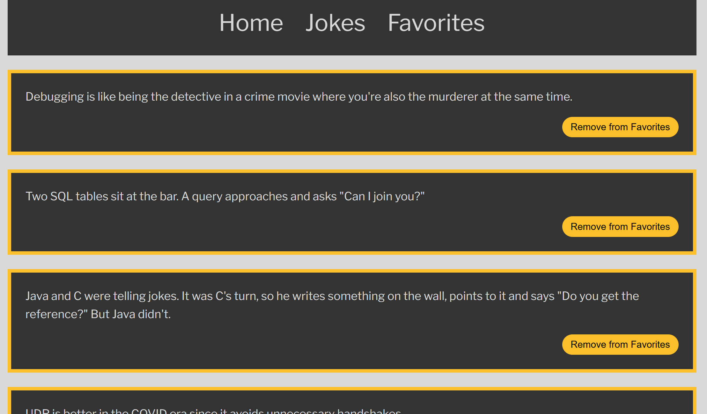

Vue3  --> 
```npm install```
```npm run dev```


server --> 
 ```npm install```
set up mongoDB in Docker
```docker build -t my-mongo .```

```docker run -p 27017:27017 --name mongo-jokes -d my-mongo```

 and then ```npm run start:nodemon```


and enjoy jokes
